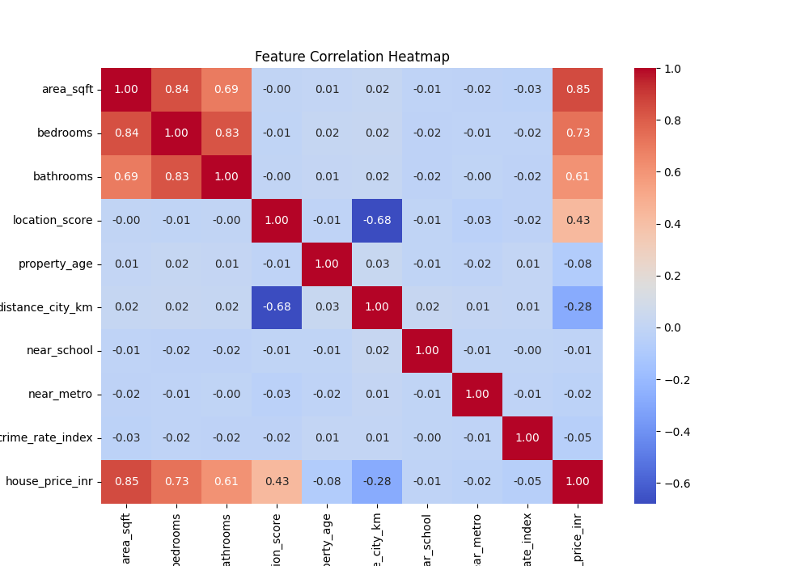
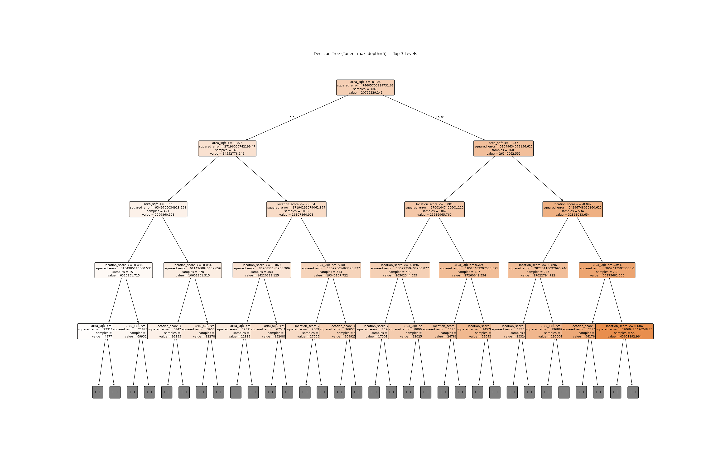
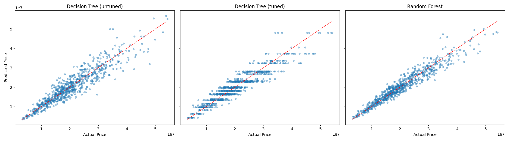

# 🏠 Robust Regression Engine — House Price Prediction

### Supervised Learning Project | Regularized Linear Models, Cross-Validation & Tree/SVR-Based Regression


---

## 📌 Overview

This project builds an **end-to-end regression pipeline** to predict house prices from property attributes, with a strong focus on **controlling overfitting** and **generalizing to unseen data**. The workflow moves progressively through regularized linear models, multiple cross-validation strategies, tree-based ensembles, and Support Vector Regression — comparing each family of models on the same train/test split for a fair, apples-to-apples evaluation.

**Dataset:** `Advanced_Regression_HousePrice_Dataset_3800.xlsx` — 3,800 property records, 12 features (area, bedrooms, bathrooms, location score, property age, distance from city, crime rate, and more).

---

## 🎯 What This Project Covers

- **Conceptual foundation** — regularization, Ridge (L2) vs Lasso (L1), and 4 cross-validation strategies (K-Fold, Stratified K-Fold, Leave-One-Out, Time Series Split)
- **EDA** — null checks, feature correlation analysis, and interpretation of key price drivers
- **Regularized linear models** — Linear Regression, Ridge, and Lasso, with `RidgeCV`/`LassoCV` for automatic alpha tuning
- **Cross-validation benchmarking** — comparing K-Fold, Stratified K-Fold, LOOCV, and Time Series Split on the same models
- **Tree-based models** — Decision Tree (default vs. tuned via `max_depth`) and Random Forest, with an overfit-gap analysis
- **Support Vector Regression** — Linear and RBF kernels, followed by a manual grid search over `C`, `gamma`, and `epsilon`
- **Full model comparison** — 9 models evaluated side-by-side on R², RMSE, and MAE, with an automated overfit/underfit diagnosis
- **Model persistence** — the best model (tuned SVR) and its scalers saved as a `.pkl` bundle with `joblib`
- **Streamlit app** — an interactive UI to enter property details and get a live price prediction

---

## 📊 Results

### Final Model Comparison (Test Set)

| Rank | Model | Train R² | Test R² | Overfit Gap |
|:---:|---|---:|---:|---:|
| 🥇 | **SVR (Tuned RBF)** | 0.9375 | **0.9383** | -0.0007 |
| 🥈 | SVR (RBF) | 0.9383 | 0.9351 | 0.0032 |
| 🥉 | Random Forest | 0.9893 | 0.9276 | 0.0617 |
| 4 | Lasso | 0.9162 | 0.9187 | -0.0026 |
| 5 | Linear Regression | 0.9162 | 0.9187 | -0.0026 |
| 6 | Ridge | 0.9162 | 0.9187 | -0.0026 |
| 7 | SVR (Linear) | 0.9154 | 0.9174 | -0.0021 |
| 8 | Decision Tree (tuned) | 0.8994 | 0.8836 | 0.0158 |
| 9 | Decision Tree (untuned) | 1.0000 | 0.8576 | 0.1424 |

**🏆 Best Model:** SVR with a tuned RBF kernel (`C=10, gamma=0.01, epsilon=0.01`), selected via manual grid search — **Test R² ≈ 0.938**, Test RMSE ≈ ₹2.16M, Test MAE ≈ ₹1.68M.

### Key Insights

- **Regularization had little effect on linear models** — Ridge and Lasso performed almost identically to plain Linear Regression, meaning the linear fit wasn't overfitting to begin with. Regularization mattered far more for the **Decision Tree**, where limiting `max_depth` cut the overfit gap from **0.14 → 0.02**.
- **Cross-validation confirmed reliability** — K-Fold (R² ≈ 0.915), Stratified K-Fold (R² ≈ 0.916), and Time Series Split (R² ≈ 0.916) all produced consistent scores, with LOOCV RMSE ≈ ₹2.54M on a subsample.
- **Non-linear models edged out linear ones** — SVR (RBF) and Random Forest slightly outperformed the linear family (~0.93–0.94 vs. ~0.92 R²), indicating a mild non-linear relationship in the data.
- **`area_sqft` (corr. 0.85) is the strongest price driver**, followed by `bedrooms` (0.73) and `bathrooms` (0.61) — though all three are highly correlated with each other. `location_score` (0.43) and `distance_city_km` (-0.28) show moderate influence.

---

## 🖼️ Visualizations

**Feature Correlation Heatmap**
Highlights `area_sqft`, `bedrooms`, and `bathrooms` as the strongest price predictors, plus multicollinearity between them.



**Tuned Decision Tree (Top Levels)**
Visualizing the top splits of the depth-limited Decision Tree, used to curb overfitting.



**Actual vs. Predicted Price — Model Comparison**
Random Forest shows the tightest fit around the ideal line; the untuned Decision Tree shows visible scatter from overfitting.



---

## 🗂️ Project Structure

```
Supervised Learning/PR2/
├── dataset/
│   └── Advanced_Regression_HousePrice_Dataset_3800.xlsx
├── Model/
│   └── house_price_model.pkl          # Saved SVR (tuned RBF) + scalers, via joblib
├── Notebook/
│   └── Robust_Regression_Engine.ipynb # Full analysis: EDA → models → CV → tuning → export
├── Screenshots/
│   ├── feature_correlation.png
│   ├── decision_tree_tuned.png
│   └── model_comparison.png
├── app.py                             # Streamlit app for live predictions
└── requirements.txt
```

---

## 🛠️ Tech Stack

| Category | Tools |
|---|---|
| Language | Python |
| Data Handling | Pandas, NumPy |
| Visualization | Matplotlib, Seaborn |
| Machine Learning | scikit-learn (Linear/Ridge/Lasso, Decision Tree, Random Forest, SVR) |
| Model Persistence | joblib |
| App / Deployment | Streamlit |

---

## ⚙️ How to Run

### 1. Explore the Notebook
```bash
git clone <repo-url>
cd Supervised-Learning-House-Price-Prediction
pip install -r requirements.txt
jupyter notebook Notebook/Robust_Regression_Engine.ipynb
```

### 2. Run the Streamlit App Locally
```bash
streamlit run app.py
```
The app retrains the pipeline on load (cached after first run), lets you enter property details (area, bedrooms, bathrooms, location score, age, distance, school/metro proximity, crime index), and returns a predicted price along with the model's test-set R², RMSE, and MAE.

### 3. Try it Live
Deployed on Streamlit Community Cloud: **[Add your Streamlit app link here]**

---

## 📈 Methodology Summary

1. **Data preparation** — dropped identifier/date columns, split 80/20 train-test, standardized numerical features with `StandardScaler`
2. **Baseline linear models** — Linear, Ridge, and Lasso Regression compared, with `RidgeCV`/`LassoCV` for optimal alpha selection
3. **Cross-validation strategies** — evaluated model stability using K-Fold, Stratified K-Fold (via binned target), Leave-One-Out, and Time-Series-aware splitting
4. **Tree-based models** — trained a default Decision Tree, then a depth-tuned version, plus a Random Forest, comparing train/test R² to diagnose overfitting
5. **Support Vector Regression** — tested Linear and RBF kernels, then ran a manual grid search over `C`, `gamma`, and `epsilon` to find the best-performing configuration
6. **Final evaluation** — consolidated all 9 models into one comparison table (R², RMSE, MAE, overfit gap) with an automated fit-quality diagnosis
7. **Deployment** — exported the best model (SVR, tuned RBF) with its scalers as a `.pkl` bundle and wrapped it in a Streamlit prediction app

---

## 👤 Author

**Your Name**
📧 your.email@example.com | 🔗 [LinkedIn](#) | 💻 [GitHub](#)

---

⭐ If you found this project useful, consider giving it a star!
